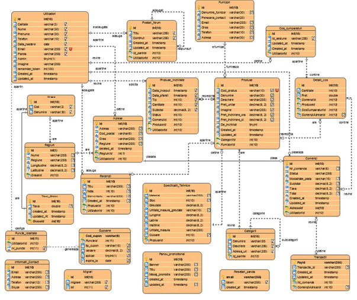

# Storemote - a web application for dropshipping.

The web application represents a management solution for a dropshipping system. It provides a **front-end for publishing products from various suppliers in the form of an interactive digital catalog**, along with **optimized browsing and search options** for customers. Importantly, it also offers **support for conducting online transactions**, such as placing orders with the possibility of making electronic payments. It provides various functionalities to **enhance the buying experience**. _ _The objectives aim to eliminate the concerns related to the implementation, maintenance, and upkeep of an information system for underdeveloped suppliers or companies._ _

The app is **divided into two modules**: the **administration module** and the **client module**. The first module can only be accessed by users with administrator privileges, while the second module supports two other types of users: visitors and clients. Depending on these three roles, interaction with the system is carried out through different procedures.

## Database schema

## Usage
1. Client module
2. Admin module