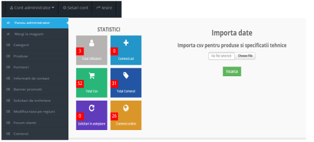
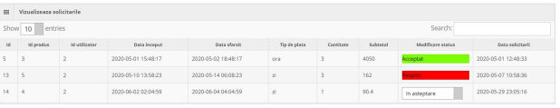
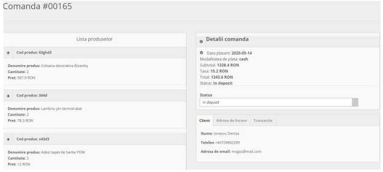

# Storemote - a web application for dropshipping construction and DIY articles.

The web application represents a management solution for a dropshipping system. It provides a **front-end for publishing products from various suppliers in the form of an interactive digital catalog**, along with **optimized browsing and search options** for customers. Importantly, it also offers **support for conducting online transactions**. It provides various functionalities to **enhance the buying experience**. _ _The objectives aim to eliminate the concerns related to the implementation, maintenance, and upkeep of an information system for underdeveloped suppliers or companies._ _

The app is **divided into two modules**: the **administration module** and the **client module**. The first module can only be accessed by users with administrator privileges, while the second module supports two other types of users: visitors and clients.

## Installation
For local web development, you need an Apache server and a database connection mediated by another server. To achieve this, the installation of XAMPP is required. The application's source code directory needs to be copied to the directory named 'htdocs' in Apache. You need to install Composer and Node.js. `php artisan serve` is the command to run the laravel project

## Database schema

## App screenshots
1. Client module
When the user opens the application, they are a visitor. The presentation section allows for navigation to other pages, as well as viewing samples of marketed products, the advertising panel, and informative announcements in the footer. There is also a product search form based on product name, material, or product code.  

Each product is accompanied by options to view details, add to cart, and leave a review. The catalog is presented below.  

To make a rental request, the customer needs to access the Rental Section. When they press the 'Request' button, a form will appear where they can fill in the required information. Next to the 'Total' field, the final price will be dynamically calculated with each generated change  

Basket  

Checkout  

My orders  
  
2. Admin module
The admin panel provides a tool for adding products from a CSV file to the database and helps visualize graphical reports on the progress of the online store.  

"Rental requests from customers for products  

The admin can view details for a specific order, including details such as the ordered products, customer information, order status, billing address, and the chosen payment method.  

3. Other
The implementation of the feature to send daily order PDFs via email.  

