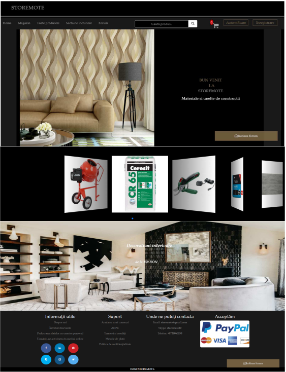
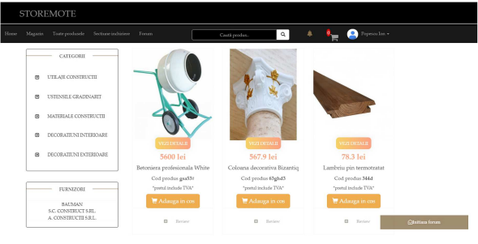
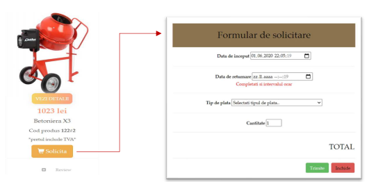
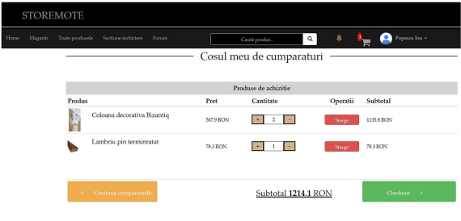
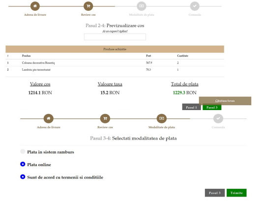
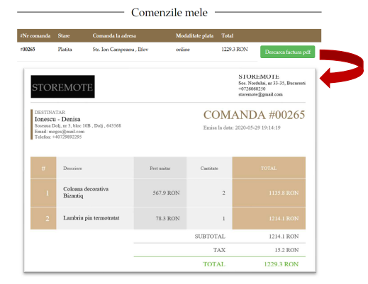

# Storemote - a web application for dropshipping construction and DIY articles.

The web application represents a management solution for a dropshipping system. It provides a **front-end for publishing products from various suppliers in the form of an interactive digital catalog**, along with **optimized browsing and search options** for customers. Importantly, it also offers **support for conducting online transactions**, such as placing orders with the possibility of making electronic payments. It provides various functionalities to **enhance the buying experience**. _ _The objectives aim to eliminate the concerns related to the implementation, maintenance, and upkeep of an information system for underdeveloped suppliers or companies._ _

The app is **divided into two modules**: the **administration module** and the **client module**. The first module can only be accessed by users with administrator privileges, while the second module supports two other types of users: visitors and clients. Depending on these three roles, interaction with the system is carried out through different procedures.

## Database schema

## Usage
1. Client module
When the user opens the application, they are a visitor. The presentation section allows for navigation to other pages, as well as viewing samples of marketed products, the advertising panel, and informative announcements in the footer. There is also a product search form based on product name, material, or product code.

Each product is accompanied by options to view details, add to cart, and leave a review. The catalog is presented below.

To make a rental request, the customer needs to access the Rental Section. When they press the 'Request' button, a form will appear where they can fill in the required information. Next to the 'Total' field, the final price will be dynamically calculated with each generated change

Basket

Checkout

My orders

2. Admin module